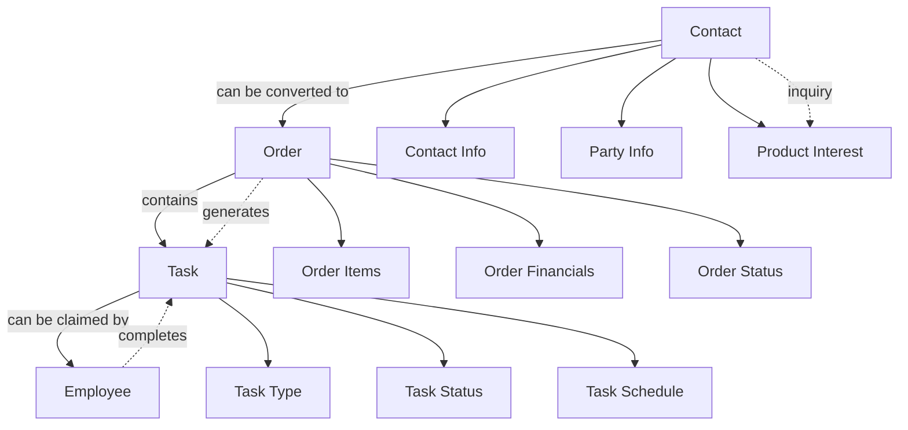

# Orders API Documentation

This document provides comprehensive documentation for the Orders system in the Bounce House Rental application. It covers the data model, API endpoints, and usage examples to help frontend developers integrate with the backend.

## Table of Contents

1. [Order Data Model](#order-data-model)
2. [API Endpoints](#api-endpoints)
   - [List Orders](#list-orders)
   - [Create Order](#create-order)
   - [Get Order by ID](#get-order-by-id)
   - [Update Order](#update-order)
   - [Delete Order](#delete-order)
   - [Payment Processing](#payment-processing)
3. [Order Status Flow](#order-status-flow)
4. [Examples](#examples)

## Order Data Model

The Order model represents a customer's order for bounce house rentals and related services.

### Core Properties

| Property             | Type                         | Description                                                          | Required                 |
| -------------------- | ---------------------------- | -------------------------------------------------------------------- | ------------------------ |
| `_id`                | `string`                     | MongoDB document ID                                                  | Auto-generated           |
| `orderNumber`        | `string`                     | Unique order identifier (e.g., BB-2024-0001)                         | Yes                      |
| `contactId`          | `string`                     | Reference to a Contact document                                      | No\*                     |
| `customerEmail`      | `string`                     | Customer's email address                                             | No\*                     |
| `items`              | `OrderItem[]`                | Array of ordered items                                               | Yes                      |
| `subtotal`           | `number`                     | Sum of all item prices                                               | Yes                      |
| `taxAmount`          | `number`                     | Tax amount                                                           | Yes                      |
| `discountAmount`     | `number`                     | Discount amount                                                      | Yes (default: 0)         |
| `deliveryFee`        | `number`                     | Delivery fee                                                         | Yes (default: $20)       |
| `processingFee`      | `number`                     | Credit card processing fee (3% of subtotal, rounded to nearest cent) | Yes (auto-calculated)    |
| `totalAmount`        | `number`                     | Final amount                                                         | Yes                      |
| `depositAmount`      | `number`                     | Initial deposit amount                                               | Yes (default: 0)         |
| `balanceDue`         | `number`                     | Remaining balance                                                    | Yes                      |
| `status`             | `OrderStatus`                | Current order status                                                 | Yes (default: "Pending") |
| `paymentStatus`      | `PaymentStatus`              | Current payment status                                               | Yes (default: "Pending") |
| `paymentMethod`      | `PaymentMethod`              | Method of payment                                                    | Yes                      |
| `paypalTransactions` | `PayPalTransactionDetails[]` | PayPal transaction details                                           | No                       |
| `notes`              | `string`                     | Additional order notes                                               | No                       |
| `tasks`              | `string[]`                   | List of tasks associated with the order                              | No                       |
| `createdAt`          | `Date`                       | Order creation date                                                  | Auto-generated           |
| `updatedAt`          | `Date`                       | Order last update date                                               | Auto-generated           |

\*Note: Either `contactId` or `customerEmail` must be provided.

### Customer Information

If an order is not associated with a contact (`contactId`), the following customer information can be provided directly:

| Property          | Type     | Description              |
| ----------------- | -------- | ------------------------ |
| `customerName`    | `string` | Customer's name          |
| `customerEmail`   | `string` | Customer's email address |
| `customerPhone`   | `string` | Customer's phone number  |
| `customerAddress` | `string` | Customer's address       |
| `customerCity`    | `string` | Customer's city          |
| `customerState`   | `string` | Customer's state         |
| `customerZipCode` | `string` | Customer's zip code      |

### Order Item

Each order contains one or more items:

| Property      | Type            | Description                                 | Required              |
| ------------- | --------------- | ------------------------------------------- | --------------------- |
| `type`        | `OrderItemType` | Type of item ("bouncer", "extra", "add-on") | Yes                   |
| `name`        | `string`        | Item name                                   | Yes                   |
| `description` | `string`        | Item description                            | No                    |
| `quantity`    | `number`        | Quantity ordered                            | Yes (default: 1)      |
| `unitPrice`   | `number`        | Price per unit                              | Yes                   |
| `totalPrice`  | `number`        | Total price (quantity \* unitPrice)         | Yes (auto-calculated) |

### PayPal Transaction

For orders paid with PayPal, transaction details are stored:

| Property        | Type                      | Description                                 | Required             |
| --------------- | ------------------------- | ------------------------------------------- | -------------------- |
| `transactionId` | `string`                  | PayPal transaction ID                       | Yes                  |
| `payerId`       | `string`                  | PayPal payer ID                             | No                   |
| `payerEmail`    | `string`                  | Payer's email address                       | No                   |
| `amount`        | `number`                  | Transaction amount                          | Yes                  |
| `currency`      | `Currency`                | Transaction currency (only "USD" supported) | Yes (default: "USD") |
| `status`        | `PayPalTransactionStatus` | Transaction status                          | Yes                  |
| `createdAt`     | `Date`                    | Transaction creation date                   | Auto-generated       |
| `updatedAt`     | `Date`                    | Transaction last update date                | No                   |

### Enums

#### OrderStatus

```typescript
type OrderStatus =
  | "Pending" // Initial state when order is created
  | "Processing" // Order is being processed
  | "Paid" // Payment has been received
  | "Confirmed" // Order has been confirmed
  | "Cancelled" // Order has been cancelled
  | "Refunded"; // Order has been refunded
```

#### PaymentStatus

```typescript
type PaymentStatus =
  | "Pending" // Payment not yet initiated
  | "Authorized" // Payment authorized but not captured
  | "Paid" // Payment completed
  | "Failed" // Payment attempt failed
  | "Refunded" // Payment fully refunded
  | "Partially Refunded"; // Payment partially refunded
```

#### PaymentMethod

```typescript
type PaymentMethod = "paypal" | "cash" | "quickbooks" | "free";
```

#### OrderItemType

```typescript
type OrderItemType = "bouncer" | "extra" | "add-on";
```

#### PayPalTransactionStatus

```typescript
type PayPalTransactionStatus =
  | "CREATED" // Transaction created but not completed
  | "SAVED" // Transaction saved for later completion
  | "APPROVED" // Transaction approved but not captured
  | "VOIDED" // Transaction voided
  | "COMPLETED" // Transaction completed successfully
  | "PAYER_ACTION_REQUIRED" // Requires additional payer action
  | "FAILED"; // Transaction failed
```

## API Endpoints

### List Orders

**Endpoint:** `GET /api/v1/orders`

**Authentication:** Required

**Query Parameters:**

| Parameter       | Type            | Description                                               |
| --------------- | --------------- | --------------------------------------------------------- |
| `startDate`     | `string`        | Filter orders created on or after this date (ISO format)  |
| `endDate`       | `string`        | Filter orders created on or before this date (ISO format) |
| `status`        | `OrderStatus`   | Filter orders by status                                   |
| `paymentStatus` | `PaymentStatus` | Filter orders by payment status                           |
| `contactId`     | `string`        | Filter orders by contact ID                               |
| `orderNumber`   | `string`        | Filter orders by order number                             |

**Response:**

```json
{
  "orders": [
    {
      "_id": "60d21b4667d0d8992e610c85",
      "orderNumber": "BB-2024-0001",
      "contactId": "60d21b4667d0d8992e610c84",
      "items": [
        {
          "type": "bouncer",
          "name": "Test Bouncer",
          "quantity": 1,
          "unitPrice": 150,
          "totalPrice": 150
        }
      ],
      "subtotal": 150,
      "taxAmount": 12.38,
      "discountAmount": 0,
      "deliveryFee": 20,
      "processingFee": 4.5,
      "totalAmount": 186.88,
      "depositAmount": 50,
      "balanceDue": 136.88,
      "status": "Pending",
      "paymentStatus": "Pending",
      "paymentMethod": "paypal",
      "createdAt": "2024-04-14T15:00:00.000Z",
      "updatedAt": "2024-04-14T15:00:00.000Z"
    }
  ]
}
```

### Create Order

**Endpoint:** `POST /api/v1/orders`

**Authentication:** Not required

**Request Body:**

```json
{
  "contactId": "60d21b4667d0d8992e610c84",
  // OR customer information if no contactId
  "customerName": "John Doe",
  "customerEmail": "john@example.com",
  "customerPhone": "123-456-7890",
  "customerAddress": "123 Main St",
  "customerCity": "San Antonio",
  "customerState": "TX",
  "customerZipCode": "78701",

  "items": [
    {
      "type": "bouncer",
      "name": "Test Bouncer",
      "quantity": 1,
      "unitPrice": 150,
      "totalPrice": 150
    }
  ],
  "taxAmount": 12.38,
  "discountAmount": 0,
  "paymentMethod": "paypal",
  "notes": "Please deliver before noon"
}
```

**Notes:**

- Either `contactId` or `customerEmail` must be provided
- The following fields are optional and will be calculated if not provided:
  - `subtotal` (calculated from items)
  - `deliveryFee` (defaults to $20)
  - `processingFee` (calculated as 3% of subtotal, rounded to nearest cent)
  - `totalAmount` (calculated from subtotal, taxAmount, deliveryFee, processingFee, and discountAmount)
  - `balanceDue` (calculated from totalAmount and depositAmount)
  - `orderNumber` (auto-generated if not provided)
  - `status` and `paymentStatus` (default to "Pending")

**Response:**

```json
{
  "_id": "60d21b4667d0d8992e610c85",
  "orderNumber": "BB-2024-0001",
  "contactId": "60d21b4667d0d8992e610c84",
  "items": [
    {
      "type": "bouncer",
      "name": "Test Bouncer",
      "quantity": 1,
      "unitPrice": 150,
      "totalPrice": 150
    }
  ],
  "subtotal": 150,
  "taxAmount": 12.38,
  "discountAmount": 0,
  "deliveryFee": 20,
  "processingFee": 4.5,
  "totalAmount": 186.88,
  "depositAmount": 0,
  "balanceDue": 186.88,
  "status": "Pending",
  "paymentStatus": "Pending",
  "paymentMethod": "paypal",
  "notes": "Please deliver before noon",
  "createdAt": "2024-04-14T15:00:00.000Z",
  "updatedAt": "2024-04-14T15:00:00.000Z"
}
```

### Get Order by ID

**Endpoint:** `GET /api/v1/orders/[id]`

**Authentication:** Required

**Response:**

```json
{
  "_id": "60d21b4667d0d8992e610c85",
  "orderNumber": "BB-2024-0001",
  "contactId": "60d21b4667d0d8992e610c84",
  "items": [
    {
      "type": "bouncer",
      "name": "Test Bouncer",
      "quantity": 1,
      "unitPrice": 150,
      "totalPrice": 150
    }
  ],
  "subtotal": 150,
  "taxAmount": 12.38,
  "discountAmount": 0,
  "deliveryFee": 20,
  "processingFee": 4.5,
  "totalAmount": 186.88,
  "depositAmount": 50,
  "balanceDue": 136.88,
  "status": "Pending",
  "paymentStatus": "Pending",
  "paymentMethod": "paypal",
  "createdAt": "2024-04-14T15:00:00.000Z",
  "updatedAt": "2024-04-14T15:00:00.000Z"
}
```

### Update Order

**Endpoint:** `PUT /api/v1/orders/[id]`

**Authentication:** Required

**Request Body:**

```json
{
  "status": "Processing",
  "notes": "Updated order notes"
}
```

**Notes:**

- Only the fields that need to be updated should be included in the request body
- Some status transitions may be restricted (e.g., cannot change from "Refunded" to "Pending")
- If items are updated, subtotal, totalAmount, and balanceDue will be recalculated

**Response:**

```json
{
  "_id": "60d21b4667d0d8992e610c85",
  "orderNumber": "BB-2024-0001",
  "contactId": "60d21b4667d0d8992e610c84",
  "items": [
    {
      "type": "bouncer",
      "name": "Test Bouncer",
      "quantity": 1,
      "unitPrice": 150,
      "totalPrice": 150
    }
  ],
  "subtotal": 150,
  "taxAmount": 12.38,
  "discountAmount": 0,
  "deliveryFee": 20,
  "processingFee": 4.5,
  "totalAmount": 186.88,
  "depositAmount": 50,
  "balanceDue": 136.88,
  "status": "Processing",
  "paymentStatus": "Pending",
  "paymentMethod": "paypal",
  "notes": "Updated order notes",
  "createdAt": "2024-04-14T15:00:00.000Z",
  "updatedAt": "2024-04-14T15:05:00.000Z"
}
```

### Delete Order

**Endpoint:** `DELETE /api/v1/orders/[id]`

**Authentication:** Required (Admin only)

**Restrictions:**

- Cannot delete orders with status "Paid" or "Confirmed"
- Only admin users can delete orders

**Response:**

```json
{
  "message": "Order deleted successfully"
}
```

### Payment Processing

#### Payment Methods

The application supports multiple payment methods:

1. **PayPal**: Online payment processed through PayPal's payment gateway
2. **Cash**: Cash payment collected at the time of delivery
3. **QuickBooks**: Payment processed through QuickBooks (admin-only)
4. **Free**: No payment required (admin-only)

#### Deposit Options

For PayPal payments, customers can choose between:

1. **Full Payment**: Pay the entire amount upfront
2. **Deposit Payment**: Pay a deposit (typically 50% of the total) upfront, with the remaining balance due at delivery

Cash payments are always processed as full payments at the time of delivery.

#### PayPal Integration

The application uses the official PayPal React SDK (`@paypal/react-paypal-js`) for payment processing. This integration provides a seamless checkout experience with both PayPal and credit card payment options.

**Key Components:**

1. **PayPalScriptProvider**: Manages the loading of the PayPal JavaScript SDK
2. **PayPalButtons**: Renders the PayPal Smart Payment Buttons

**Configuration:**

```typescript
// PayPal configuration (src/config/paypal.ts)
export const paypalConfig = {
  clientId: process.env.NEXT_PUBLIC_PAYPAL_CLIENT_ID,
  currency: "USD",
  intent: "capture",
  components: "buttons",
};
```

**Implementation in Checkout:**

The PayPal integration is implemented in the Step5_Payment component of the checkout process:

```typescript
<PayPalScriptProvider options={paypalConfig}>
  <PayPalButtons
    style={{
      layout: "vertical",
      color: "gold",
      shape: "rect",
      label: "pay",
      height: 45
    }}
    createOrder={(data, actions) => {
      // For deposit payments, use depositAmount instead of totalAmount
      const paymentAmount = state.depositAmount > 0 ? state.depositAmount : state.totalAmount;

      return actions.order.create({
        intent: "CAPTURE",
        purchase_units: [
          {
            amount: {
              value: paymentAmount.toFixed(2),
              currency_code: "USD",
            },
            description: state.depositAmount > 0
              ? "Bounce House Rental - Deposit Payment"
              : "Bounce House Rental - Full Payment",
          },
        ],
        application_context: {
          shipping_preference: "NO_SHIPPING",
          user_action: "PAY_NOW",
        },
      });
    }}
    onApprove={async (data, actions) => {
      const orderDetails = await actions.order.capture();
      // Process successful payment
      handlePaymentSuccess(orderDetails.id);
    }}
    onError={(err) => {
      // Handle payment errors
      handlePaymentError(err);
    }}
  />
</PayPalScriptProvider>
```

**PayPal Payment Flow:**

1. User selects PayPal as payment method
2. User chooses between full payment or deposit payment (if applicable)
3. User clicks the PayPal button
4. PayPal modal opens for payment selection (PayPal account or credit card)
5. User completes payment in the PayPal interface
6. On successful payment, the `onApprove` callback is triggered
7. The application captures the payment and updates the order status
8. The order details are sent to the backend for processing

**Cash Payment Flow:**

1. User selects Cash on Delivery as payment method
2. User completes the order (no online payment required)
3. Order is created with status "Pending" and payment status "Pending"
4. Customer pays in cash at the time of delivery
5. Admin updates the order status after receiving payment

#### Initiate Payment

**Endpoint:** `POST /api/v1/orders/[id]/payment`

**Authentication:** Not required

**Request Body:**

```json
{
  "amount": 186.88
}
```

**Notes:**

- The amount must match either the total amount or the deposit amount
- This endpoint simulates initiating a PayPal payment and returns a PayPal order ID

**Response:**

```json
{
  "paypalOrderId": "PAY-1234567890",
  "amount": 186.88,
  "currency": "USD",
  "orderNumber": "BB-2024-0001"
}
```

#### Record Payment Transaction

**Endpoint:** `PATCH /api/v1/orders/[id]/payment`

**Authentication:** Not required

**Request Body:**

```json
{
  "transactionId": "PAY-123456789",
  "payerId": "PAYER-123",
  "payerEmail": "customer@example.com",
  "amount": 186.88,
  "currency": "USD",
  "status": "COMPLETED"
}
```

**Notes:**

- This endpoint records a payment transaction and updates the order's payment status
- If the payment is for the full amount, the order status will be updated to "Paid"
- If the payment is for the deposit amount, the payment status will be updated to "Authorized"
- Multiple partial payments can be recorded, and the balance due will be updated accordingly

**Response:**

```json
{
  "message": "Payment transaction recorded successfully",
  "order": {
    "_id": "60d21b4667d0d8992e610c85",
    "orderNumber": "BB-2024-0001",
    "contactId": "60d21b4667d0d8992e610c84",
    "items": [
      {
        "type": "bouncer",
        "name": "Test Bouncer",
        "quantity": 1,
        "unitPrice": 150,
        "totalPrice": 150
      }
    ],
    "subtotal": 150,
    "taxAmount": 12.38,
    "discountAmount": 0,
    "deliveryFee": 20,
    "processingFee": 4.5,
    "totalAmount": 186.88,
    "depositAmount": 50,
    "balanceDue": 0,
    "status": "Paid",
    "paymentStatus": "Paid",
    "paymentMethod": "paypal",
    "paypalTransactions": [
      {
        "transactionId": "PAY-123456789",
        "payerId": "PAYER-123",
        "payerEmail": "customer@example.com",
        "amount": 186.88,
        "currency": "USD",
        "status": "COMPLETED",
        "createdAt": "2024-04-14T15:10:00.000Z"
      }
    ],
    "createdAt": "2024-04-14T15:00:00.000Z",
    "updatedAt": "2024-04-14T15:10:00.000Z"
  }
}
```

#### Troubleshooting PayPal Integration

Common issues and solutions:

1. **PayPal SDK Loading Errors**:

   - Ensure the `NEXT_PUBLIC_PAYPAL_CLIENT_ID` environment variable is correctly set
   - Check for browser console errors related to script loading
   - Verify network connectivity to PayPal domains

2. **Payment Button Not Appearing**:

   - Confirm the PayPalScriptProvider is properly configured
   - Ensure the PayPal client ID is valid and has the correct permissions
   - Check for any Content Security Policy (CSP) restrictions

3. **Payment Processing Errors**:

   - Verify the order amount is valid and properly formatted
   - Ensure the PayPal account is properly configured for accepting payments
   - Check the browser console for detailed error messages

4. **Testing in Development**:
   - Use PayPal Sandbox accounts for testing
   - Create test buyer and seller accounts in the PayPal Developer Dashboard
   - Use the PayPal Sandbox mode by setting the appropriate client ID

## Order Status Flow

The typical flow of an order is as follows:

1. **Pending**: Initial state when an order is created
2. **Processing**: Order is being processed (optional)
3. **Paid**: Payment has been received in full
4. **Confirmed**: Order has been confirmed and scheduled
5. **Cancelled** or **Refunded**: If the order is cancelled or refunded

The payment status follows a similar flow:

1. **Pending**: Initial state when an order is created
2. **Authorized**: Deposit payment has been received
3. **Paid**: Full payment has been received
4. **Failed**: Payment attempt failed
5. **Refunded** or **Partially Refunded**: If the payment is refunded

### Payment Method Specific Flows

#### PayPal Payment Flow

1. Order created with `paymentMethod: "paypal"`
2. If full payment:
   - Payment processed via PayPal
   - Order status updated to "Paid"
   - Payment status updated to "Paid"
3. If deposit payment:
   - Deposit processed via PayPal
   - Order status remains "Pending"
   - Payment status updated to "Authorized"
   - Balance due collected at delivery or pickup

#### Cash Payment Flow

1. Order created with `paymentMethod: "cash"`
2. Order status set to "Pending"
3. Payment status set to "Pending"
4. Full payment collected at delivery
5. Admin updates order status to "Paid" after receiving payment

## Examples

### Creating a New Order

```javascript
// Example: Creating a new order with a contact ID
const createOrder = async (contactId) => {
  const response = await fetch("/api/v1/orders", {
    method: "POST",
    headers: {
      "Content-Type": "application/json",
    },
    body: JSON.stringify({
      contactId,
      items: [
        {
          type: "bouncer",
          name: "Castle Bounce House",
          quantity: 1,
          unitPrice: 150,
          totalPrice: 150,
        },
        {
          type: "extra",
          name: "Generator",
          quantity: 1,
          unitPrice: 50,
          totalPrice: 50,
        },
      ],
      taxAmount: 16.5,
      discountAmount: 0,
      paymentMethod: "paypal",
      notes: "Please deliver before noon",
    }),
  });

  return await response.json();
};

// Example: Creating a new order with direct customer information
const createOrderWithCustomerInfo = async () => {
  const response = await fetch("/api/v1/orders", {
    method: "POST",
    headers: {
      "Content-Type": "application/json",
    },
    body: JSON.stringify({
      customerName: "John Doe",
      customerEmail: "john@example.com",
      customerPhone: "123-456-7890",
      customerAddress: "123 Main St",
      customerCity: "San Antonio",
      customerState: "TX",
      customerZipCode: "78701",
      items: [
        {
          type: "bouncer",
          name: "Castle Bounce House",
          quantity: 1,
          unitPrice: 150,
          totalPrice: 150,
        },
      ],
      taxAmount: 12.38,
      discountAmount: 0,
      paymentMethod: "paypal",
    }),
  });

  return await response.json();
};
```

### Processing a Payment

```javascript
// Example: Processing a payment for an order
const processPayment = async (orderId, amount) => {
  // Step 1: Initiate payment
  const initiateResponse = await fetch(`/api/v1/orders/${orderId}/payment`, {
    method: "POST",
    headers: {
      "Content-Type": "application/json",
    },
    body: JSON.stringify({
      amount,
    }),
  });

  const paymentInit = await initiateResponse.json();

  // Step 2: In a real implementation, you would redirect to PayPal for payment
  // and then receive a callback with the transaction details

  // Step 3: Record payment transaction
  const recordResponse = await fetch(`/api/v1/orders/${orderId}/payment`, {
    method: "PATCH",
    headers: {
      "Content-Type": "application/json",
    },
    body: JSON.stringify({
      transactionId: paymentInit.paypalOrderId, // In a real implementation, this would come from PayPal
      payerId: "PAYER-123",
      payerEmail: "customer@example.com",
      amount,
      currency: "USD",
      status: "COMPLETED",
    }),
  });

  return await recordResponse.json();
};
```

### Fetching Orders

```javascript
// Example: Fetching all orders
const fetchOrders = async (token) => {
  const response = await fetch("/api/v1/orders", {
    headers: {
      Authorization: `Bearer ${token}`,
    },
  });

  return await response.json();
};

// Example: Fetching orders with filters
const fetchFilteredOrders = async (token, filters) => {
  const queryParams = new URLSearchParams();

  if (filters.startDate) queryParams.append("startDate", filters.startDate);
  if (filters.endDate) queryParams.append("endDate", filters.endDate);
  if (filters.status) queryParams.append("status", filters.status);
  if (filters.paymentStatus)
    queryParams.append("paymentStatus", filters.paymentStatus);
  if (filters.contactId) queryParams.append("contactId", filters.contactId);
  if (filters.orderNumber)
    queryParams.append("orderNumber", filters.orderNumber);

  const response = await fetch(`/api/v1/orders?${queryParams.toString()}`, {
    headers: {
      Authorization: `Bearer ${token}`,
    },
  });

  return await response.json();
};
```

### Updating an Order

```javascript
// Example: Updating an order
const updateOrder = async (orderId, token, updates) => {
  const response = await fetch(`/api/v1/orders/${orderId}`, {
    method: "PUT",
    headers: {
      "Content-Type": "application/json",
      Authorization: `Bearer ${token}`,
    },
    body: JSON.stringify(updates),
  });

  return await response.json();
};

// Example: Updating order status
const updateOrderStatus = async (orderId, token, status) => {
  return await updateOrder(orderId, token, { status });
};
```

### Deleting an Order

```javascript
// Example: Deleting an order (admin only)
const deleteOrder = async (orderId, adminToken) => {
  const response = await fetch(`/api/v1/orders/${orderId}`, {
    method: "DELETE",
    headers: {
      Authorization: `Bearer ${adminToken}`,
    },
  });

  return await response.json();
};
```

This documentation should provide a comprehensive guide for frontend developers to integrate with the Orders API.

## Contact-Order-Task Relationship

The following diagram illustrates the relationship between Contacts, Orders, and Tasks in the system:



In this workflow:

1. **Contacts** represent customer inquiries and contain basic customer information and product interests
2. **Orders** are created from contacts (or directly) and contain detailed information about products, pricing, and payment
3. **Tasks** are generated from orders and represent specific jobs that need to be completed (delivery, setup, pickup, etc.)
4. **Employees** can claim and complete tasks

### Task Management

Tasks are an array of jobs associated with each order. The admin can create jobs which are available to be claimed by employees. Tasks can include a variety of activities needed for a party rental business:

- **Delivery**: Transporting equipment to the customer's location
- **Setup**: Assembling and preparing equipment at the location
- **Attendant**: Providing on-site supervision during the event
- **Pickup**: Disassembling and retrieving equipment after the event
- **Cleaning**: Sanitizing and preparing equipment for the next rental
- **Maintenance**: Performing repairs or routine maintenance on equipment

Each task has its own lifecycle (created → assigned → in progress → completed) and can be tracked separately within the system.

## Frontend Checkout Implementation

The frontend checkout process is implemented as a multi-step wizard that guides customers through the rental selection, delivery information
